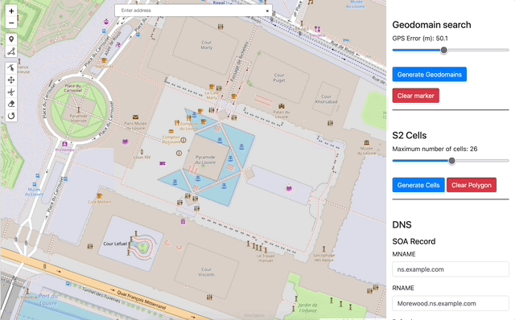

# Geo-domain explorer

The Geo-domain explorer tool helps visualize geo-domains in OpenFLAME. The tool is hosted [here](https://openflam.github.io/geo-domain-explorer/). Read the documentation on how to use the tool in the [Geo-domain explorer section on the main website](https://openflam.github.io/pages/tools/geodomain-explorer.html). 

## Building the webpage

The webpage is a static page with everything happening in the `index.html` file at the root of this repository. The map and all its funtionality is handled by `assets/main.js`. This javascript is generated using [webpack](https://webpack.js.org/) and the code is available in the `map-js/` directory. Go to the README file within the directory to see how to build the `main.js` file.

All the S2 cells logic (covering a region with S2 cells, getting the boundaries of an S2 cell, conversion between S2 cell index formats, etc) is handled in the Go code in the `s2-region-covere-go/` directory. The Go code is compiled to the wasm file at `assets/wasm/region-coverer.wasm`. Go to the README file in the directory to see how to compile this wasm file from Go code. The javascript code in `map-js/` directory assumes the presence of this wasm file and uses it as a resource.